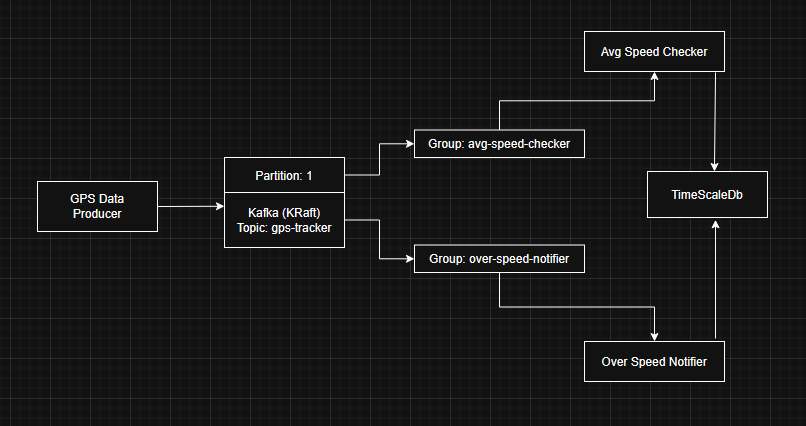
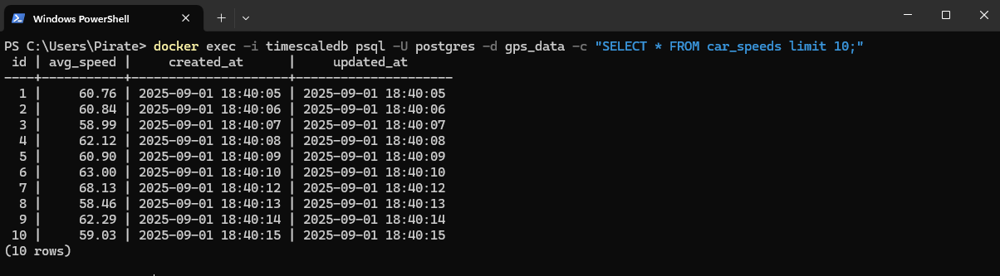
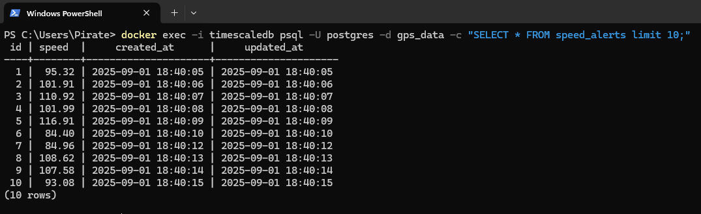

## GPS Tracking Kafka Project

### 1. Overview
- This project simulates a real-time GPS tracking system using Kafka and Laravel:
- Producer: Simulates GPS devices sending messages (location, speed, time, etc.) to Kafka over time. For simulates behaviour 10ms delay has been added for each message

Consumers:
- Avg-Speed Checker – Aggregates and stores average speed per batch.
- Over-Speed Notifier – Sends real-time notifications when speed exceeds a threshold.

Topic: gps-tracker (1 partition)
- Consumer Groups: 2 separate groups for different logic.
- Database: TimescaleDB (considered for time-series historical GPS data).

Fully Dockerized: all services run with docker-compose.

### 2. Architecture Diagram



### 3. Features
Features
- Kafka producer sends GPS data (simulated or real) in JSON format.
- Laravel consumers process messages in batches to reduce DB load.
- Average speed aggregation stored in TimescaleDB.
- Real-time over-speed notifications (ready to integrate with Vue.js frontend).
- Shared migration runner ensures migrations for both consumers run sequentially to prevent DB conflicts.
- Dockerized with single docker-compose up -d command to run the full stack.

### 4. Folder Structure
````
laravel-kafka/
│
├─ avg-speed-checker/          # Laravel consumer 1
├─ over-speed-notifier/        # Laravel consumer 2
├─ gps-data-producer/          # Laravel producer
├─ commands/                   # Utility scripts: wait for db to be ready and migrates
├─ docker-compose.yml
├─ README.md
````

### 5. Prerequisites
- Docker >= 24
- Docker Compose >= 2.20
- PHP >= 8.2 (handled inside container)

### 6. Setup & Run


#### 6.1 Clone the repository
````
git clone git@github.com:mahfuzdiu/laravel-kafka.git
cd laravel-kafka
````

#### 6.2 Build all Docker images
````
docker-compose build
````

#### 6.3 Run the project
````
docker-compose up -d
````

#### 6.4 Visit [GPS Data Producer](http://localhost:7000/) to send messages to kafka
#### 6.5 Visit [Kafka UI](http://localhost:8080/) to check messages, groups and consumers
#### 6.6 Data Set

Message format

````json
{
    "device_id": "device_39",
    "latitude": 23.721589,
    "longitude": 90.30598,
    "speed": 39.69,
    "timestamp": "2025-09-01T18:40:04+00:00"
}
````

Average Speed Data Set



Over Speed Data Set: 80 is the speed limit


### 7. Important Notes

- Migration order: shared-migration runs first, then consumers start.
- Database readiness: Consumers wait for TimescaleDB using check-db-status-and-migrate.sh.
- Kafka readiness: Consumers wait for Kafka broker to be ready before subscribing to topics.
- Scaling: To increase throughput, add more consumers in the same group or increase partitions.

### 8. Monitoring

- This project uses Kafka UI to monitor the GPS data pipeline in real time. It allows you to:
- View all topics and partitions, including the gps_data topic used by the project.
- Observe producer activity (gps-data-producer) and ensure messages are being sent correctly.
- Track consumer groups (avg-speed-checker and over-speed-notifier) and monitor their progress.
- Check consumer lag, so you can see if any consumer is falling behind the incoming data stream.

Debug issues like message consumption errors or unexpected offsets without directly accessing Kafka logs.

Kafka UI provides a visual interface to track the health and performance of your data pipeline, making it easier to ensure that batch processing and real-time notifications work as expected.

### 9. Docker Services Overview
````
├─ gps-data-producer ─ Laravel app simulating GPS devices
├─ avg-speed-checker ─ Consumer group 1, aggregates speed
├─ over-speed-notifier ─ Consumer group 2, real-time notifications
├─ timescaledb ─ Time-series DB for historical data
├─ kafka ─ Kafka broker (KRaft mode)
├─ kafka ui 
├─ shared-migration	─ Runs migrations sequentially for both consumers to avoid race condition
````

### 10. Scaling
- Can be increased partitions in Kafka to improve parallelism.
- Run multiple instances of consumers in the same group to balance the load.
- TimescaleDB efficiently handles high-frequency inserts for GPS data.

### 11. Future Plan
- Real-Time Alerts: Extended over-speed-notifier to push alerts via WebSocket or push notifications to the dashboard
- Fault Tolerance: Implementation of retries and dead-letter topics to handle message failures more robustly.
- Monitoring & Logging: Integrating Prometheus/Grafana for Kafka and Laravel metrics.

## 📄 License

This project is open-sourced under the [MIT License](LICENSE).
